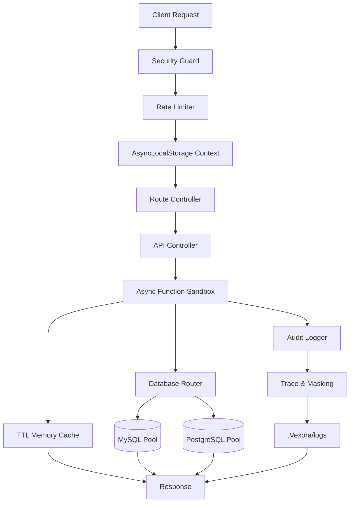

# 👋 Hi, I'm Satyam Kumar

### Full-Stack Developer · Backend Engineer · Framework & Developer Tools Builder

<p align="center">
  
  
  
  
</p>

<p align="center">
  
  
</p>

---

## 🚀 About Me

I'm a **Full-Stack Developer and Backend Engineer** focused on building reliable backend systems, APIs, web applications, Android applications, frameworks, and developer tools.

I enjoy understanding technology at the system level — not just using frameworks, but understanding **how they work internally, where they fail, and how they can be improved**.

My current focus is around:

* ⚡ Backend architecture & API engineering
* 🧩 Framework and developer-tool development
* 🔐 Application & API security
* 🗄️ Database architecture and optimization
* 🌐 Full-stack application development
* 📱 Android development with Java
* ⚙️ Performance-oriented Node.js systems
* 🧠 Understanding systems from the core

> **Build from the core. Understand the system. Control the complexity.**

---

# ⚡ Vexora

### My Node.js Framework

<p align="center">
  <a href="https://www.npmjs.com/package/vexora">
    
  </a>
  <a href="https://www.npmjs.com/package/vexora">
    
  </a>
  <a href="https://github.com/Satyam9725/vexora">
    
  </a>
  <a href="https://github.com/Satyam9725/vexora">
    
  </a>
</p>

**Vexora** is my own Node.js framework designed around:

* Native Node.js capabilities
* Lightweight architecture
* Security-first request processing
* Performance
* Minimal dependency usage
* Modular backend architecture
* Database abstraction
* Developer-friendly APIs

Instead of depending on a large ecosystem of packages for every backend requirement, Vexora focuses on building important functionality around the **Node.js runtime itself**.

### 🏗️ Vexora Architecture



### 🔑 Core Concepts

| Component            | Purpose                                  |
| -------------------- | ---------------------------------------- |
| 🛡️ Security Guard   | Request validation and security controls |
| 🚦 Rate Limiter      | Protects APIs from excessive requests    |
| 🧵 AsyncLocalStorage | Request-scoped execution context         |
| 🛣️ Route Controller | Structured request routing               |
| 🎮 API Controller    | Application/business logic layer         |
| 🧩 Sandbox Evaluator | Controlled async controller execution    |
| 🗄️ Database Router  | Database connection/pool selection       |
| 💾 TTL Cache         | Lightweight in-memory caching            |
| 📝 Audit Logger      | Silent logging and traceability          |
| 🔐 Masking           | Helps prevent sensitive data exposure    |

### 📦 Install Vexora

```bash
npm install vexora
```

### 🔗 Links

* **GitHub:** https://github.com/Satyam9725/vexora
* **npm:** https://www.npmjs.com/package/vexora

---

# 🧩 Developer Tools

I also build **VS Code extensions and developer tooling** focused on improving development workflows.

### Areas of Interest

* 🛠️ Custom developer tools
* ⚡ Developer productivity
* 🧩 VS Code extensions
* 📦 Project tooling
* 🚀 Framework tooling
* 🔍 Development automation
* 🧠 Code intelligence

---

# 🛠️ Technology Stack

## 🌐 Frontend

<p align="left">
  
</p>

**HTML · CSS · JavaScript · React · Next.js**

---

## ⚙️ Backend

<p align="left">
  
</p>

| Technology | Experience |
| ---------- | ---------: |
| PHP        |   7+ Years |
| Node.js    |    1+ Year |
| Python     |   Learning |

---

## 📱 Mobile Development

<p align="left">
  
</p>

**Java · Android**

---

## 🗄️ Databases

<p align="left">
  
</p>

| Database   | Experience |
| ---------- | ---------: |
| MySQL      |   7+ Years |
| PostgreSQL |   5+ Years |
| MongoDB    |   Learning |

---

## 🔧 Development Tools

<p align="left">
  
</p>

**Git · GitHub · VS Code · npm · Linux**

---

# 🔐 Engineering Focus

My development work is especially focused on:

```text
Security
   ↓
Architecture
   ↓
Performance
   ↓
Database Design
   ↓
API Engineering
   ↓
Developer Experience
```

### Areas

* 🔒 Application Security
* 🔐 API Security
* 🛡️ Authentication & Authorization
* ⚡ Backend Performance
* 🏗️ Scalable Architecture
* 🗄️ Database Systems
* 🔌 REST API Development
* 📦 Framework Engineering
* 🧩 Developer Tools
* 📱 Android Applications
* 🌐 Full-Stack Applications

---

# 🏢 EFORMX

I'm also involved in building **EFORMX**, a digital services and technology platform.

My engineering work includes:

* 🌐 Web applications
* ⚙️ Backend systems
* 🔌 APIs
* 🗄️ Database architecture
* 📱 Android applications
* 🔐 Authentication systems
* 🛡️ Security infrastructure
* 🏗️ Digital platform infrastructure

---

# 🧠 Engineering Philosophy

> **Build from the core. Understand the system. Keep dependencies under control. Build securely.**

I don't just want to **use technology**.

I want to understand:

* How it works internally
* Why it works
* Where it can fail
* How it can be optimized
* How security can be improved
* How unnecessary complexity can be removed
* How the same concept can be built from the fundamentals

---

# 📊 GitHub Statistics

<p align="center">
  
  
</p>

---

# 🔥 GitHub Streak

<p align="center">
  
</p>

---

# 📈 Contribution Graph

<p align="center">
  
</p>

---

# 📌 What I'm Building

### ⚡ Vexora

A lightweight Node.js framework focused on:

* Performance
* Security
* Native Node.js APIs
* Database abstraction
* Request context
* Caching
* Logging
* Developer experience

### 🧩 Developer Tools

Building tools and extensions that improve developer workflows and reduce repetitive development tasks.

### 🌐 Backend Systems

Designing APIs and backend infrastructure with a focus on:

**Security + Performance + Maintainability**

---

# 🎯 Current Learning

```text
Python
   │
   ├── Backend Development
   ├── Automation
   └── Systems Programming

MongoDB
   │
   ├── Data Modeling
   ├── Query Optimization
   └── Scalable Applications
```

---

# 🤝 Open to Collaboration

I'm interested in collaborating on:

* 🚀 Open-source projects
* ⚡ Node.js projects
* 🧩 Developer tools
* 🌐 Full-stack applications
* 📱 Android applications
* 🔐 Security-focused software
* 🏗️ Backend architecture
* 🧠 Framework development
* 📦 npm packages
* 🛠️ VS Code extensions

---

# 📫 Connect With Me

<p align="center">

<a href="https://github.com/Satyam9725">
  
</a>

<a href="https://www.npmjs.com/package/vexora">
  
</a>

</p>

---

# ⚡ Developer Motto

<p align="center">

### 🚀 Build From the Core

**⚡ Keep Learning · 🔐 Build Securely · 🧩 Create Your Own Tools**

</p>

---

<p align="center">
  <strong>Thanks for visiting my profile! 👋</strong>
</p>

<p align="center">
  <sub>Building systems, tools and ideas — one commit at a time.</sub>
</p>
