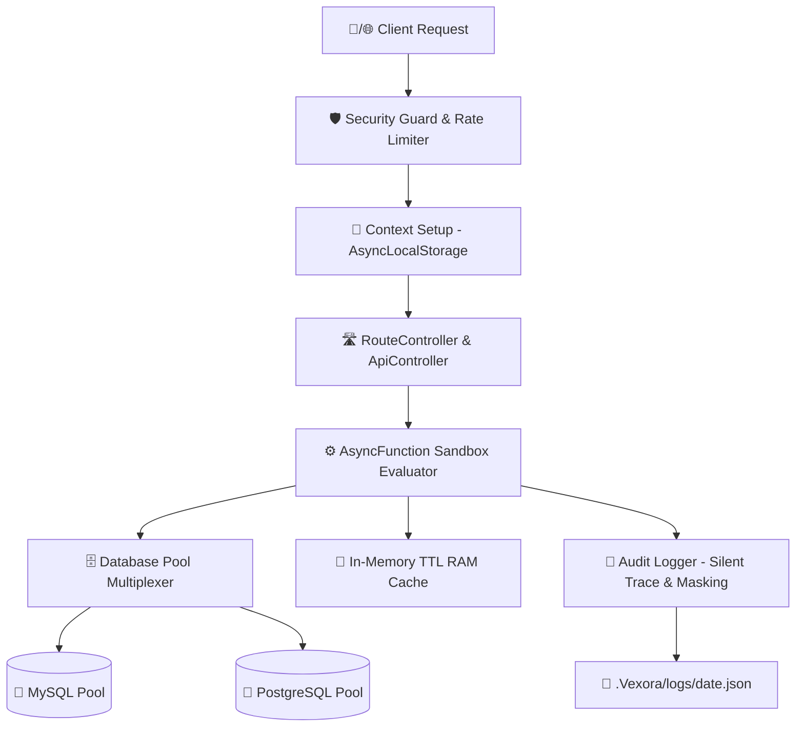

<h1 align="center">
  
</h1>

<p align="center">
  <strong>Full-Stack Developer · Backend Specialist · Framework & Developer Tools Builder</strong>
</p>

<p align="center">
  <a href="https://github.com/Satyam9725"></a>
  <a href="https://github.com/Satyam9725?tab=followers"></a>
  <a href="https://github.com/Satyam9725"></a>
  <a href="https://www.npmjs.com/package/vexora"></a>
</p>
<p align="center">
  
</p>

---

## 🚀 About Me

I am a passionate **Full-Stack & Backend Developer** specializing in high-performance backend systems, custom APIs, web & Android applications, as well as developer tooling.

I believe in **building solutions from first principles**—understanding core architecture deeply and creating efficient, lightweight solutions rather than relying on bloated external dependencies.

- ⚡ **Framework Building:** Author of **[Vexora](https://github.com/Satyam9725/vexora)**, a native Node.js framework.
- 🧩 **Dev Tools:** Crafting custom VS Code extensions for developer productivity.
- ⚙️ **Backend Engineering:** Designing robust RESTful APIs & asynchronous microservices.
- 🌐 **Web Development:** Modern full-stack web applications with React, Next.js & PHP.
- 📱 **Mobile Development:** Native Android app creation using Java.
- 🔐 **Security First:** Writing secure code with built-in audit logging, rate limiting & context safety.
- 🗄️ **Database Architecture:** Designing optimized relational schemas and pooling systems.
- 🌱 **Learning & Growing:** Currently expanding expertise in Python & MongoDB.

---

## ⚡ Featured Project: Vexora Framework

> **"My Own Lightweight, Native Node.js Backend Framework"**

Vexora is designed around native Node.js capabilities, offering maximum performance, minimal dependency overhead, and core-level security features.

### 🏗️ How Vexora Works



### 🔑 Key Architecture Concepts

- ⚡ **Native Node.js Core** – Zero bloat, leveraging pure Node.js performance.
- 🛡️ **Built-in Security Guard** – Integrated rate limiting and request sanitization.
- 🧵 **AsyncLocalStorage Context** – Safe, thread-like state isolation across async operations.
- 🛣️ **Controller-based Routing** – Clean separation of API endpoints and logic.
- 🗄️ **Dual Database Pooling** – Built-in multiplexing for MySQL and PostgreSQL.
- 💾 **In-Memory TTL Cache** – Fast RAM caching without external Redis dependency.
- 📝 **Silent Audit Logger** – Trace logging with automatic sensitive data masking.

### 📦 Quick Start

```bash
npm install vexora
```

<p align="left">
  <a href="https://github.com/Satyam9725/vexora">
    
  </a>
  <a href="https://www.npmjs.com/package/vexora">
    
  </a>
</p>

---

## 🛠️ Tech Stack & Skills

### 🌐 Frontend Development
<p align="left">
  <a href="https://skillicons.dev">
    
  </a>
</p>
<code>HTML5</code> · <code>CSS3</code> · <code>JavaScript (ES6+)</code> · <code>React.js</code> · <code>Next.js</code>

---

### ⚙️ Backend Engineering
<p align="left">
  <a href="https://skillicons.dev">
    
  </a>
</p>

| Technology | Experience Level | Specialization |
| :--- | :--- | :--- |
| **PHP** | 7+ Years | Architecture, Custom APIs, Legacy & Modern Backends |
| **Node.js** | 1+ Year | Core HTTP, Framework Building, Async I/O |
| **Python** | Learning | Scripting, Automation & Systems |

---

### 🗄️ Database Management
<p align="left">
  <a href="https://skillicons.dev">
    
  </a>
</p>

| Database | Experience Level | Highlights |
| :--- | :--- | :--- |
| **MySQL** | 7+ Years | Query Optimization, Indexing, Schema Design |
| **PostgreSQL** | 5+ Years | Pool Multiplexing, Complex Queries |
| **MongoDB** | Learning | NoSQL Data Modeling |

---

### 📱 Mobile Development
<p align="left">
  <a href="https://skillicons.dev">
    
  </a>
</p>
<code>Java</code> · <code>Android Studio</code> · <code>Native Android Architecture</code>

---

### 🔧 Tools & Environment
<p align="left">
  <a href="https://skillicons.dev">
    
  </a>
</p>
<code>Git</code> · <code>GitHub</code> · <code>VS Code</code> · <code>npm</code>

---

## 🧩 VS Code Extensions

I build custom extensions for Visual Studio Code to improve developer productivity and tooling workflows:

- 🛠️ **Custom Developer Tools** – Automating routine coding patterns.
- ⚡ **Productivity Enhancers** – Speeding up file navigation & code generation.
- 🧩 **Editor & Framework Tooling** – Custom syntax, snippets, and project generators.

---

## 🏢 EFORMX Digital Platform

Involved in engineering **EFORMX**, a comprehensive digital services and tech platform:

- 🌐 Full-stack web infrastructure
- ⚙️ Scalable backend & API gateways
- 🗄️ High-availability database design
- 📱 Native Android mobile application integration
- 🔐 Secure multi-factor authentication systems

---

## 📊 GitHub Analytics

<p align="center">
  
  
</p>

<p align="center">
  
</p>

<p align="center">
  
</p>

---

## 🎯 Development Philosophy

> *"Build from the core. Understand the system. Keep dependencies under control. Build securely."*

I don't just use technology—I seek to understand how it works under the hood, how to optimize it, and how to build better developer-first tools.

---

## 🤝 Open to Collaboration

I am always interested in discussing and collaborating on:
- 🚀 Open-source Node.js & PHP projects
- ⚡ Framework architecture & developer tools
- 🔐 Security-focused backend applications
- 📱 Native Android projects

---

## 📫 Connect With Me

<p align="center">
  <a href="https://github.com/Satyam9725">
    
  </a>
  <a href="https://www.npmjs.com/package/vexora">
    
  </a>
</p>

---

<p align="center">
  <strong>🚀 Build From the Core · ⚡ Keep Learning · 🔐 Build Securely · 🧩 Create Your Own Tools</strong>
</p>
<p align="center">
  <em>Thanks for visiting my profile! 👋</em>
</p>
